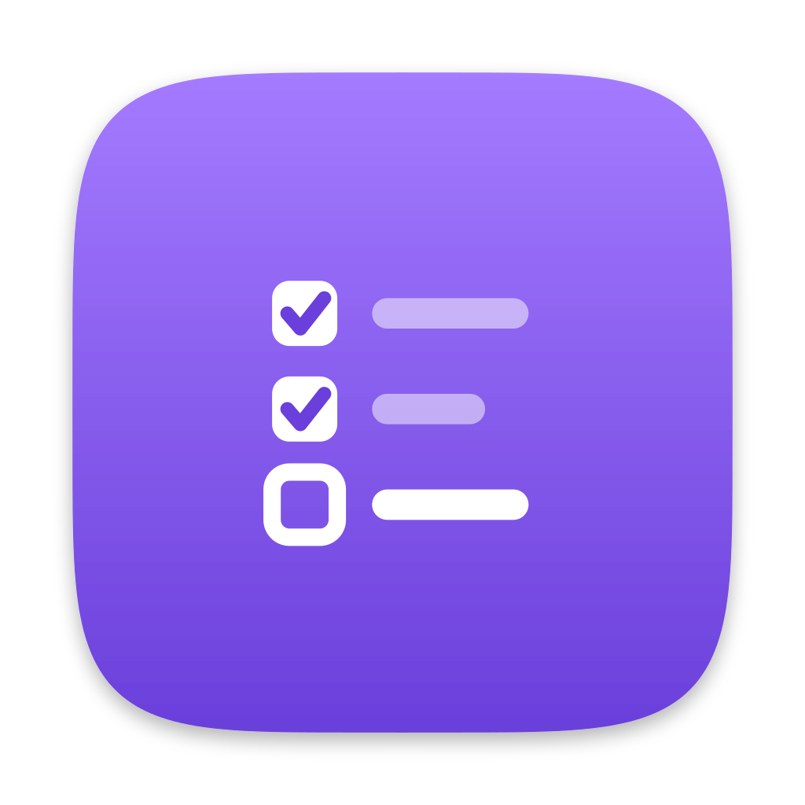

# whatagain

A todo list for coding agents, scoped to repos.

Note something down the moment you think of it, from whatever repo or worktree you happen to be in. `whatagain` works out which project you mean from the `origin` remote, so there is nothing to select and nothing to configure.

```sh
$ whatagain add "fix the flaky land test"
Added 2437 to dittofleet/shigoto-no-mori: fix the flaky land test

$ whatagain ls
dittofleet/shigoto-no-mori
  2437  fix the flaky land test
  cae3  ship the windows build

$ whatagain rm 2437
Removed 2437 from dittofleet/shigoto-no-mori: fix the flaky land test
```

When one line does not say enough, hang a description off the item. It is optional everywhere, so items without one stay the single line they always were:

```sh
$ whatagain add "fix the flaky land test" -d "only fails in CI, suspect the temp dir"
$ whatagain desc cae3 "needs a signing cert first"

$ whatagain ls
dittofleet/shigoto-no-mori
  2437  fix the flaky land test
        only fails in CI, suspect the temp dir
  cae3  ship the windows build
        needs a signing cert first
```

Drop a description again with `whatagain desc cae3 --clear`.

Tags are words you hang on an item to find it again. Nothing registers them: a tag exists as long as some item carries it.

```sh
$ whatagain add "sign the installer" -t windows,release
$ whatagain tag cae3 windows

$ whatagain ls -t windows
dittofleet/shigoto-no-mori
  cae3  ship the windows build  #windows
  7d10  sign the installer  #windows #release
```

Filter on several tags to get the items carrying all of them. Take one back off with `whatagain untag cae3 windows`, or drop them all with `whatagain tag cae3 --clear`.

Not every note is about a repo. `-g` keeps one on the global list instead of a project:

```sh
$ whatagain add -g "renew the passport"
Added 4b21 to the global list: renew the passport

$ whatagain ls -g
(no project)
  4b21  renew the passport
```

Ids are unique across the whole store, so `desc`, `tag`, and `rm` reach a global item without the flag, and `ls --all` shows the list alongside the projects.

Run `whatagain help` for the rest of the commands.

## Projects, registered once

A repo registered in [terrier](https://github.com/dittofleet/terrier) becomes a project here, so there is no second registration to remember:

```sh
$ cd ~/src/lichen
$ terrier add
Registered dittofleet/lichen (~/src/lichen)

$ whatagain add "document the conflict rules"
Added 3f9a to dittofleet/lichen: document the conflict rules
```

Terrier is checked whenever the list is read or written, and a repo it holds is taken into the store rather than read past on the way. That is what keeps the project the same on every machine: terrier registers paths, so its registry belongs to the machine it was written on, while the store is the thing that syncs.

Nothing goes the other way. Unregistering a repo in terrier says a path is no longer worth keeping, which is a smaller thing than deleting notes on every machine you own, so the project and its items stay. Drop it with `whatagain projects rm` once terrier no longer has it.

Terrier is optional. Without it, the projects are the ones added here and nothing else is different.

## Install

```sh
curl -fsSL https://raw.githubusercontent.com/dittofleet/.github/main/install.sh | sh -s whatagain
```

Installs the latest release to `~/.local/bin/whatagain` (override with `WHATAGAIN_INSTALL_DIR`). Supported platforms: macOS (arm64, x64), Linux (arm64, x64).

## The store

Everything lives in one JSON file at `~/.config/whatagain/todo.json`, created on the first write. Sync it with [lichen](https://github.com/dittofleet/lichen), or anything else that syncs dotfiles, and the list follows you between machines:

```sh
lichen sync ~/.config/whatagain/todo.json
```

## Agent skill

`skills/whatagain/SKILL.md` tells a coding agent what the list is for and when to reach for it, so "note that down for later" lands in the right project without you spelling out the command.
